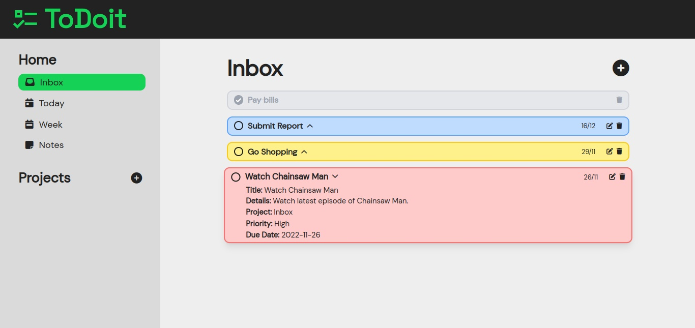
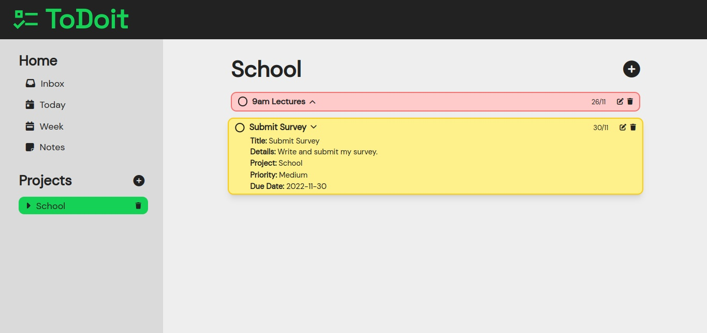
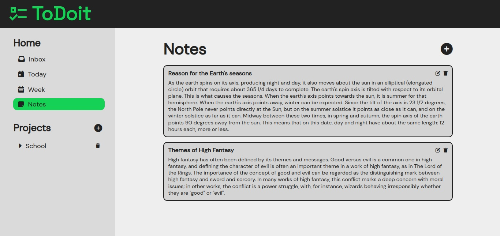

# ToDoit

  

Preview the app - [ToDoit](https://todoit-gzmn.netlify.app).  

ToDoit is a to-do list app built with Tailwind CSS, Webpack and JavaScript.

- Create, view, edit and delete to-do items.
- Create projects to add a group of to-do items.  
  
- Create, view, edit and delete notes.  
  

## Technologies used

- JavaScript
- Tailwind CSS
- Webpack

## Installation

To install ToDoit locally, follow the steps below:

- Clone repo to your machine
- Open the root of the project and install all dependencies withthe following command:

```bash
npm install
```

- Run the following script to run the local version of the project:

```bash
npm run dev
```

## What I learned

- How to use JavaScript Modules
- How to install, configure and setup Webpack with Tailwind CSS
- How to use local storage
- How to install and use an external JS library (date-fns)
- How to install and setup a linter (ESLint)
- How to install and setup a code style guide (Prettier)

## Source
This project is done as part of [The Odin Project](https://www.theodinproject.com) curriculum.
